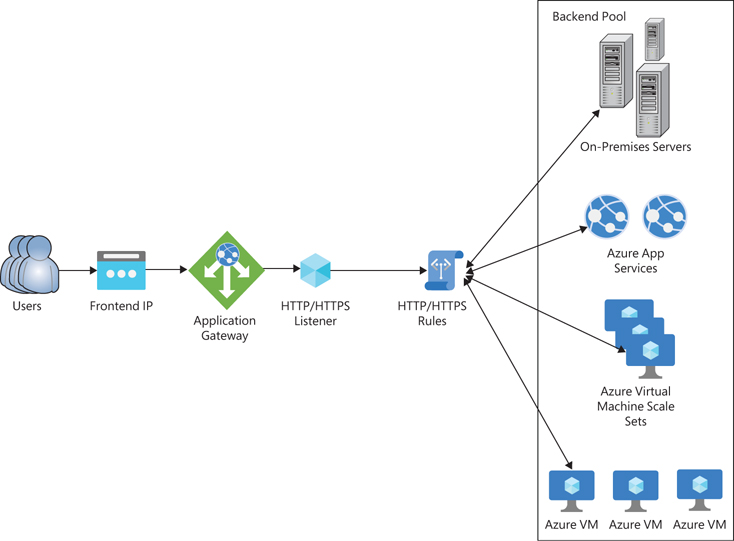
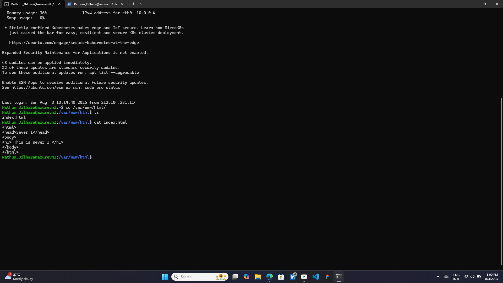
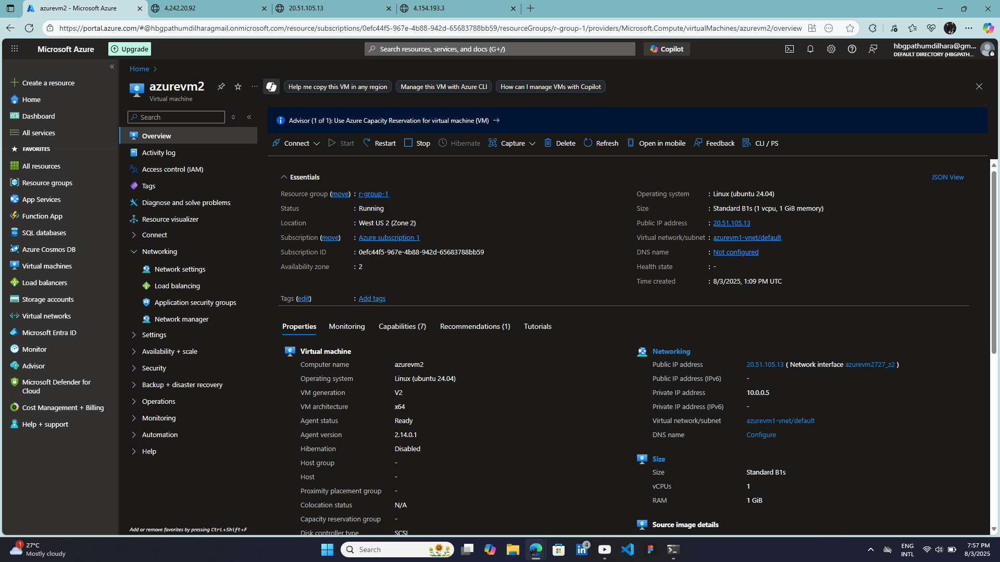
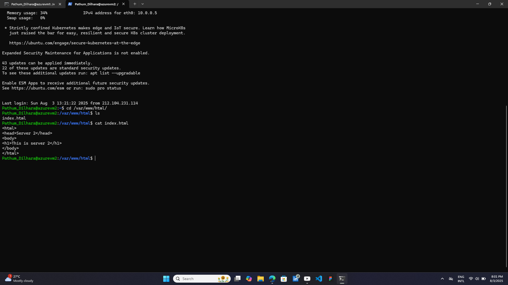
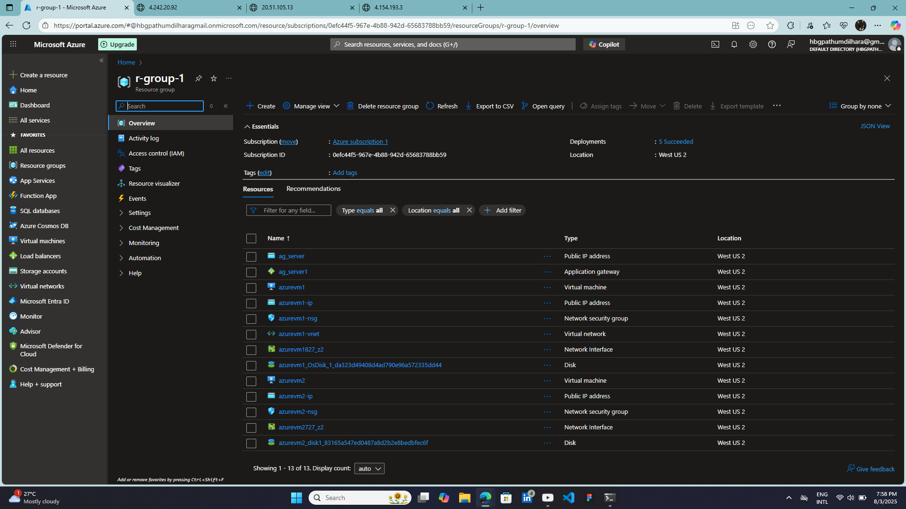
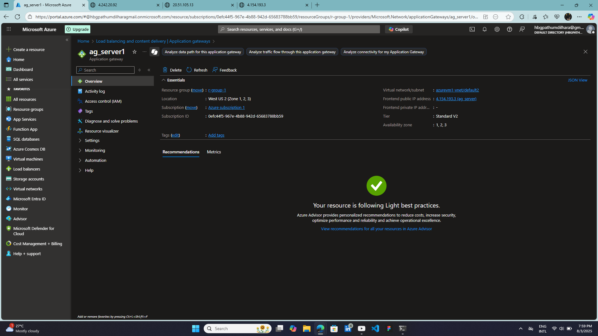
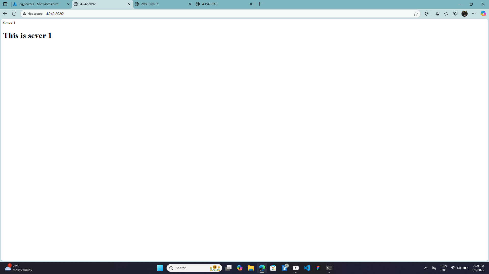
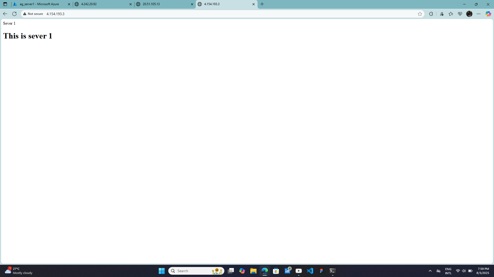
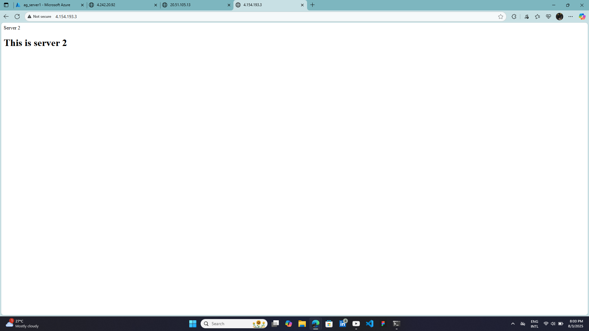

# 🌐 Web Hosting with Load Balancing using Azure and Terraform

This project demonstrates a basic web hosting architecture on Microsoft Azure with high availability and load balancing. The setup includes **Azure Virtual Machines**, **Azure Application Gateway**, and **Azure Traffic Manager**, running on **Linux** VMs and serving static web content built with **HTML**.

## 📊 Architecture Overview


- **Traffic Manager** routes incoming DNS requests based on routing rules.
- **Application Gateway** balances HTTP/HTTPS traffic across multiple Azure Linux VMs.
- Each **Linux VM** hosts a simple HTML website served via Apache

## 🧰 Technologies Used

- Terraform (IaC) 
- Microsoft Azure
  - Azure Virtual Machines (Linux)
  - Azure Application Gateway
  - Azure Traffic Manager (DNS-based Load Balancing)
- HTML (Static Website Content)
- Linux (Ubuntu)
- Apache2 (optional for local web server)

## 🛠️ Installation & Setup

### Prerequisites

- Azure Subscription
- Basic knowledge of Azure Networking and Linux

### Steps

1. **Create Azure Resource Group**
2. **Deploy Linux Virtual Machines**
   - Use the Azure portal or CLI to create 2+ Linux VMs. Install Apache2 and host your HTML content
     ```
     sudo apt-get update
     sudo apt-get install apache2
     sudo mv index.html /var/www/html/
     ```
3. **Create and Configure Azure Application Gateway**
   - Backend Pool: Add VM public/private IPs
   - HTTP Listener: Port 80 or 443
   - Routing Rules: Basic rule to route to VMs

4. **Set Up Azure Traffic Manager**
   - Create a Traffic Manager profile
   - Add endpoints (Application Gateway public IP)

5. **Test the Setup**
   - Visit the Traffic Manager DNS name in your browser
   - Confirm load balancing across VMs

## 📸 Screenshots

Azure VM-1



Azure VM-2



Resource Group


Azure Application Gateway


Hosting Server 1


Hosting Server 2


Load Balancing between two servers



## 🔗Live Demo

[Watch Demo Video](Images/Azure-Loadbalancer.mp4)
[Watch Demo Video](Images/Traffic-Manager.mp4)
